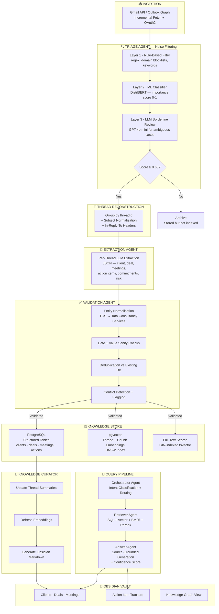
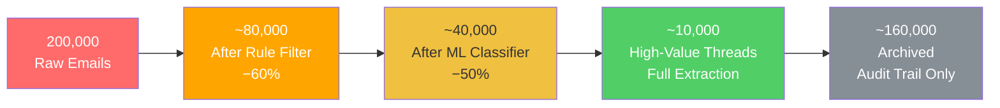
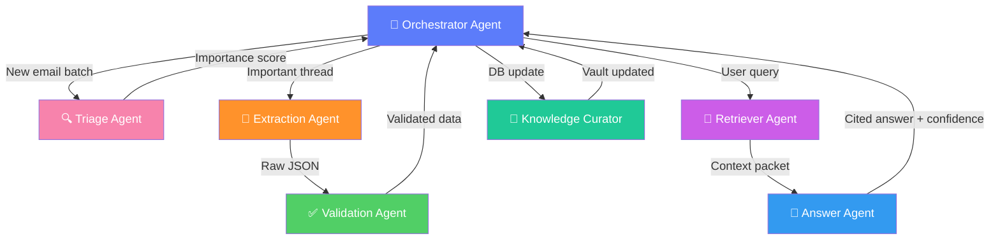
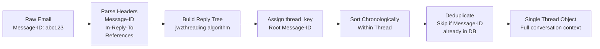
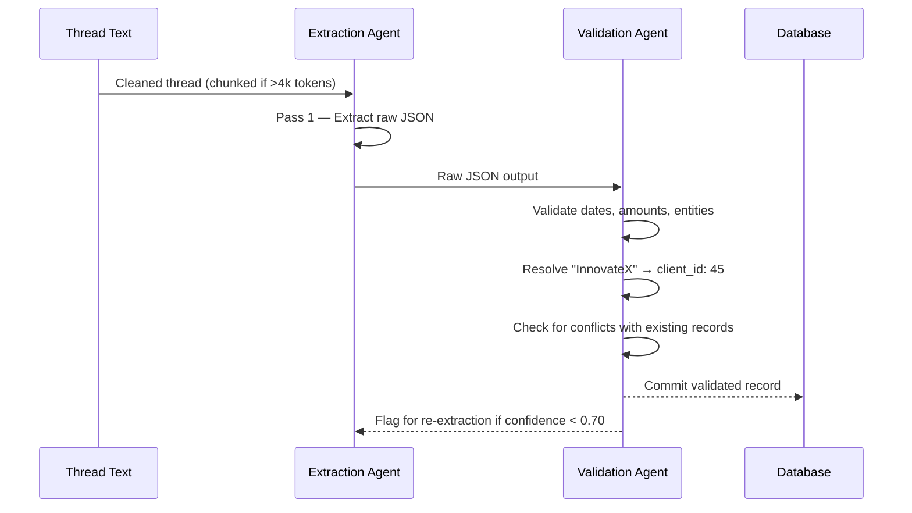
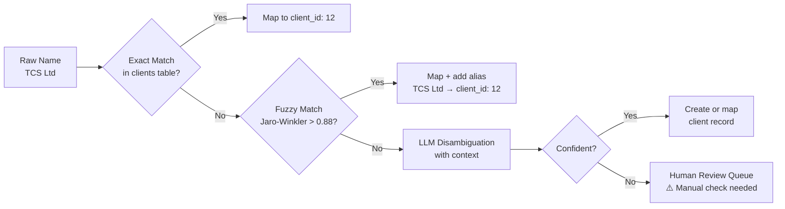
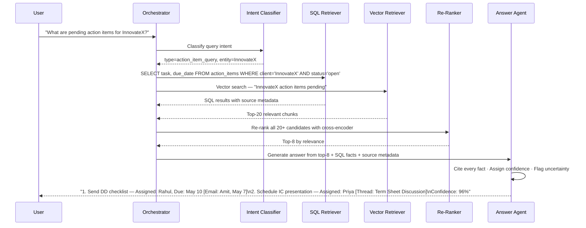
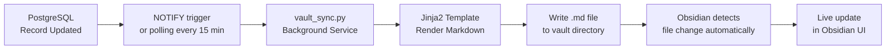
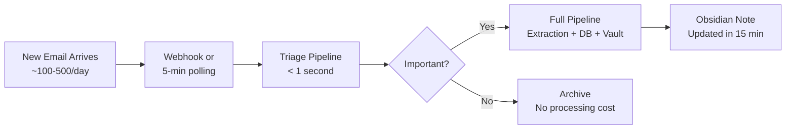
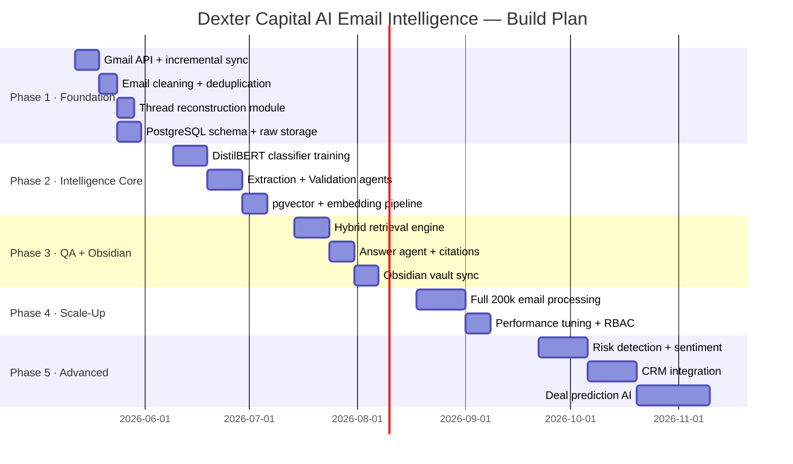

# AI Email Intelligence System

## Dexter Capital / Ventures — Enterprise Knowledge Platform

> [!abstract] Executive Brief **200,000+ emails → Structured Institutional Memory → Source-Cited AI Answers** This platform ingests the entire Dexter Capital email history, separates deal intelligence from noise, extracts structured knowledge (deals, meetings, commitments, action items), and delivers accurate answers with full source traceability — synced into this Obsidian vault as a living knowledge graph.

---

## 📑 Table of Contents

|Section|Description|
|---|---|
|[[#🔥 The Problem]]|Why email is a broken knowledge system|
|[[#⚠️ Challenges & Difficulty Matrix]]|12 engineering difficulties with severity|
|[[#🏗️ Full System Architecture]]|End-to-end pipeline flow (Mermaid)|
|[[#🤖 Multi-Agent System Design]]|7 specialised agents and their roles|
|[[#🔍 Noise Filtering — 200k Emails]]|3-layer classification engine|
|[[#🧵 Thread Reconstruction]]|How conversations are rebuilt|
|[[#📄 AI Extraction Layer]]|Structured entity extraction via LLM|
|[[#✅ Validation Pipeline]]|Accuracy hardening before DB writes|
|[[#🗄️ Database Architecture]]|PostgreSQL + pgvector hybrid schema|
|[[#💬 RAG Query Engine]]|7-step retrieval + answer pipeline|
|[[#📓 Obsidian Vault Integration]]|This vault — structure, sync, graph view|
|[[#📊 Scalability & Cost]]|Performance estimates for 2 lakh mails|
|[[#🛠️ Tech Stack]]|Full technology decisions with rationale|
|[[#🗺️ Implementation Roadmap]]|5 phases across 24 weeks|
|[[#🏁 Conclusion & Next Steps]]|Success metrics and immediate actions|

---

## 🔥 The Problem

> [!danger] The Hidden Knowledge Crisis at Dexter Capital Every deal negotiation, LP commitment, board discussion, and client follow-up exists as a line in an inbox — buried, inaccessible, and depreciating in value by the hour.

### What Is Trapped Inside 200,000 Emails

```
📧 Deal term negotiations        → "What was the final valuation agreed with InnovateX?"
📅 Meeting outcomes & MOMs       → "What did we commit to in the May 5th call?"
💰 Pricing & budget discussions  → "Which LP asked for a revised carry structure?"
✅ Action items & commitments    → "Who was supposed to send the due diligence checklist?"
⚠️  Risk signals & red flags     → "Did the founder ever raise concerns about the timeline?"
```

### Business Impact Table

|Pain Point|Real Consequence|
|---|---|
|No deal status visibility|Partners manually chase updates; deals stall silently|
|Lost action items|Client commitments missed; trust damaged|
|Employee churn|Complete deal context disappears with the person|
|Onboarding lag|New analysts spend weeks reading historical threads|
|Duplicated negotiations|Teams unknowingly re-negotiate settled terms|
|No cross-deal intelligence|Same LP objection pattern never spotted across deals|

> [!quote] McKinsey Research Knowledge workers spend **28% of their workweek** managing email — yet less than **30%** of that information is ever retained beyond the inbox.

---

## ⚠️ Challenges & Difficulty Matrix

| #       | Challenge                                                          | Business Impact                                   | Severity    |
| ------- | ------------------------------------------------------------------ | ------------------------------------------------- | ----------- |
| **D1**  | 200k email volume — processing without cost explosion              | System viability, operational cost                | 🔴 Critical |
| **D2**  | Irrelevant emails — HR, newsletters, OTPs (~70% of volume)         | Polluted DB, noisy retrieval, hallucinations      | 🔴 Critical |
| **D3**  | Conversation threading across replies, forwards, subject changes   | Lost deal narrative and chronology                | 🔴 Critical |
| **D4**  | Accurate extraction — deal value, stage, action items, commitments | Wrong answers → wrong investment decisions        | 🔴 Critical |
| **D5**  | Hallucination prevention — LLM must never fabricate facts          | User mistrust, legal risk, fund reputation        | 🔴 Critical |
| **D6**  | Temporal reasoning — deal progression over months                  | Can't answer "what changed after the term sheet?" | 🟠 High     |
| **D7**  | Entity resolution — "TCS" vs "Tata" vs "TCS Ltd"                   | Fragmented client view, missed relationships      | 🟠 High     |
| **D8**  | Hybrid retrieval — fact lookups vs contextual questions            | Sub-optimal answers, manual re-checking           | 🟠 High     |
| **D9**  | Incremental updates — 100-500 new emails per day                   | Stale knowledge, high reprocessing cost           | 🟡 Medium   |
| **D10** | Obsidian vault sync — notes must stay consistent with DB           | Dual-source confusion, versioning conflicts       | 🟡 Medium   |
| **D11** | Source citation — every answer must reference the original email   | Enterprise adoption, trust                        | 🟠 High     |
| **D12** | Privacy & access control — SEBI/GDPR compliance                    | Regulatory violation, reputational damage         | 🔴 Critical |

> [!success] Key Promise Every single difficulty above is directly addressed by a dedicated component of this architecture. No difficulty is "accepted" — each has an engineering solution.

---

## 🏗️ Full System Architecture

> [!tip] Mermaid Rendering Enable via **Settings → Editor → Enable Mermaid** if diagrams don't appear. A text-only fallback is available at the [[#📐 Text-Only Architecture Fallback]] section.

### End-to-End Pipeline Flow



### Volume Reduction Through the Pipeline



> [!info] Cost Optimisation Only **~5-10%** of all emails ever reach expensive LLM extraction. The rest is handled by free rule-matching or cheap ML models — making the system viable at scale without runaway API costs.

---

## 🤖 Multi-Agent System Design

Rather than a single monolithic LLM pipeline, this system uses **7 specialised agents** — each fine-tuned (prompt, model, context) for exactly one job. This prevents any single failure from cascading and makes every step auditable.

### Agent Roster

|Agent|Primary Job|Model|Solves|
|---|---|---|---|
|**🔍 Triage Agent**|Classify + filter all incoming emails|Rules + DistilBERT + GPT-4o mini|D1, D2, D12|
|**📄 Extraction Agent**|Extract structured JSON from important threads|GPT-4o / Claude Sonnet|D4, D6, D7|
|**✅ Validation Agent**|Normalise entities, validate values, detect conflicts|GPT-4o mini + deterministic checks|D4, D5, D7|
|**🔎 Retriever Agent**|Execute hybrid SQL + vector search + re-rank|Embedding model + Cohere Rerank|D5, D8|
|**💬 Answer Agent**|Generate source-cited answer with confidence score|GPT-4o / Claude|D5, D11|
|**🔧 Knowledge Curator**|Manage incremental updates + Obsidian sync|Lightweight LLM + logic|D9, D10|
|**🎯 Orchestrator**|Parse intent, sequence agents, manage state|GPT-4o mini / programmatic|All|

### Agent Communication Flow



> [!warning] Why Not One Big LLM? A single GPT call for everything is fragile: one prompt failure breaks the whole pipeline, costs are uncontrolled, outputs are unauditable, and accuracy degrades as task complexity grows. The multi-agent split gives each task the right model and the right context — and makes failures isolated and debuggable.

---

## 🔍 Noise Filtering — 200k Emails

This is the **most important cost-control component** in the entire system.

### Layer 1 — Rule-Based Hard Filter

_Cost: $0.00 | Speed: <1ms per email | Eliminates: ~40-60% of volume_

```
✗  Sender domain: noreply@  donotreply@  alerts@  payroll@  newsletter@
✗  Subject patterns: "Leave Approved" | "Your OTP" | "Salary Slip" | "Unsubscribe"
✗  Body fingerprints: unsubscribe links, automated alert templates
✗  Zero-reply threads older than 180 days with no business keywords
```

### Layer 2 — ML Classifier

_Model: fine-tuned DistilBERT | Speed: ~5ms per email | Runs on CPU_

|Confidence Score|Action|Rationale|
|---|---|---|
|**0.85 – 1.00**|Full extraction + embedding|Business-critical — process completely|
|**0.60 – 0.84**|Embedding only, no extraction|Possibly relevant — store for search|
|**0.00 – 0.59**|Archive only|Noise — retained for audit, never indexed|

### Layer 3 — Thread-Level Scoring Override

Individual email scores can mislead. A thread is **promoted to high importance** even if individual messages score low, when it shows:

> [!check] Thread Promotion Signals
> 
> - Thread depth > 5 replies (sustained engagement)
> - Attachment with business filename: `proposal`, `termsheet`, `contract`, `invoice`
> - External domain participants alongside internal Dexter senders
> - Monetary values detected anywhere: ₹ $ € £ + numeric pattern
> - Meeting/call patterns: "meeting scheduled", "call at", "demo on", "discussed"

---

## 🧵 Thread Reconstruction

> [!important] The Atomic Unit Is a Thread, Not an Email A single pricing email is meaningless without the preceding negotiation. An approval reply only has value alongside the original proposal. The pipeline treats **entire conversation threads** as the unit of processing.

### Reconstruction Algorithm



### Fallback Strategy

If RFC-5322 headers are missing or incomplete:

1. **Subject normalisation** — strip `Re:`, `Fwd:`, `[EXT]`, collapse whitespace, fuzzy match
2. **Participant overlap** — group threads sharing the same external domain + time window
3. **Temporal proximity** — emails within 72 hours with similar subjects are candidates

---

## 📄 AI Extraction Layer

Every thread scoring ≥ 0.85 is submitted to the Extraction Agent. The LLM returns **only validated JSON** — never prose.

### Extraction Schema

```json
{
  "client_name": "InnovateX Pvt Ltd",
  "aliases": ["InnovateX", "InnovateX Technologies"],
  "deal_stage": "Term Sheet",
  "deal_value": { "amount": 25000000, "currency": "INR" },
  "decision_maker": { "name": "Amit Sharma", "role": "CEO" },
  "requirements": [
    "Custom LP reporting dashboard",
    "API integration with existing portfolio tools"
  ],
  "commitments": [
    "Dexter to send final DD checklist by May 10",
    "IC presentation scheduled for May 15"
  ],
  "action_items": [
    {
      "task": "Send revised term sheet",
      "assigned_to": "rahul@dextercap.com",
      "due_date": "2026-05-10",
      "status": "open"
    }
  ],
  "risk_signals": ["Founder raised timeline concerns on May 7"],
  "meeting_dates": ["2026-05-02", "2026-05-07"],
  "sentiment_score": 0.72,
  "summary": "Active Series A discussion. Term sheet shared May 7. Positive sentiment but timeline risk flagged by founder."
}
```

### Two-Pass Extraction Strategy



---

## ✅ Validation Pipeline

> [!danger] LLM Output Is Never Written Directly to the Database Every extraction passes through a validation service before any record is committed. This is what separates enterprise-grade accuracy from a toy chatbot.

### Validation Checks

|Check|Method|Action on Failure|
|---|---|---|
|**Date plausibility**|Parsed + compared to email timestamps|Nulled + flagged|
|**Currency normalisation**|Regex + known currency table|Standardised or flagged|
|**Entity resolution**|Fuzzy match (Jaro-Winkler ≥ 0.88) → LLM disambiguation|Merged or queued for review|
|**Value range checks**|Domain-specific bounds (e.g. deal value > ₹1L)|Flagged as outlier|
|**Deduplication**|Compare action items/meetings vs existing DB rows|Update rather than insert|
|**Confidence threshold**|Overall extraction confidence < 0.70|Human review queue|

### Entity Resolution Pipeline



---

## 🗄️ Database Architecture

### Design Decision: PostgreSQL + pgvector

> [!info] Why One Database? pgvector co-locates structured relational data with semantic vector embeddings inside a single PostgreSQL instance. This enables **atomic hybrid queries** — combining SQL `WHERE` clauses with cosine similarity in a single statement — impossible when vector and relational stores are separate systems.

### Core Schema

```sql
-- CLIENTS: Canonical entity registry
clients (
    id              SERIAL PRIMARY KEY,
    canonical_name  TEXT UNIQUE NOT NULL,
    aliases         TEXT[],          -- All known name variants
    domain          TEXT,
    industry        TEXT,
    first_contact   TIMESTAMP,
    relationship_stage TEXT          -- 'Prospect' | 'Active' | 'Portfolio' | 'Dormant'
);

-- DEALS: Investment pipeline tracking
deals (
    id                  SERIAL PRIMARY KEY,
    client_id           INT REFERENCES clients(id),
    thread_id           TEXT NOT NULL,
    name                TEXT,
    stage               TEXT,        -- 'Sourcing' | 'DD' | 'Term Sheet' | 'Closed' | 'Lost'
    value_amount        NUMERIC,
    value_currency      TEXT,
    probability         NUMERIC(3,2),
    expected_close      DATE,
    created_at          TIMESTAMP,
    updated_at          TIMESTAMP
);

-- MEETINGS: Auto-generated MOM records
meetings (
    id              SERIAL PRIMARY KEY,
    thread_id       TEXT NOT NULL,
    client_id       INT REFERENCES clients(id),
    meeting_date    TIMESTAMP,
    attendees       TEXT[],
    summary         TEXT,
    decisions       TEXT[],
    next_steps      TEXT[],
    mom_generated   BOOLEAN DEFAULT FALSE
);

-- ACTION ITEMS: Task tracker with source linkage
action_items (
    id              SERIAL PRIMARY KEY,
    thread_id       TEXT,
    deal_id         INT REFERENCES deals(id),
    task            TEXT NOT NULL,
    assigned_to     TEXT,
    due_date        DATE,
    status          TEXT DEFAULT 'open',   -- 'open' | 'done' | 'overdue'
    source_email_id TEXT                   -- Exact email reference for citation
);

-- COMMITMENTS: Trackable promises with fulfillment status
commitments (
    id              SERIAL PRIMARY KEY,
    thread_id       TEXT,
    committed_by    TEXT,
    commitment_text TEXT,
    committed_at    TIMESTAMP,
    fulfilled       BOOLEAN DEFAULT FALSE
);

-- RISK EVENTS: Automated risk signal log
risk_events (
    id              SERIAL PRIMARY KEY,
    client_id       INT REFERENCES clients(id),
    deal_id         INT REFERENCES deals(id),
    risk_type       TEXT,   -- 'unresponsive' | 'budget_mismatch' | 'sentiment_drop'
    description     TEXT,
    detected_at     TIMESTAMP,
    severity        TEXT    -- 'low' | 'medium' | 'high'
);

-- EMBEDDINGS: Vector store (pgvector)
CREATE EXTENSION vector;

thread_embeddings (
    thread_id       TEXT PRIMARY KEY,
    embedding       vector(1536),    -- text-embedding-3-large
    summary_text    TEXT,
    updated_at      TIMESTAMP
);

email_chunks (
    id              SERIAL PRIMARY KEY,
    email_id        TEXT,
    thread_id       TEXT,
    chunk_text      TEXT,
    chunk_index     INT,
    embedding       vector(1536),
    token_count     INT
);

-- PERFORMANCE INDEXES
CREATE INDEX idx_deals_client ON deals(client_id);
CREATE INDEX idx_actions_status ON action_items(status, due_date);
CREATE INDEX idx_emails_fts ON emails USING GIN(to_tsvector('english', body_clean));
CREATE INDEX idx_thread_emb ON thread_embeddings USING hnsw(embedding vector_cosine_ops);
CREATE INDEX idx_chunk_emb ON email_chunks USING hnsw(embedding vector_cosine_ops);
```

### Embedding Strategy

|Level|What Gets Embedded|Used For|
|---|---|---|
|**Thread-level**|AI-generated summary of entire thread|Broad semantic search, similar-thread discovery|
|**Chunk-level**|400-token overlapping chunks (50-token overlap)|Precise fact retrieval within long threads|

---

## 💬 RAG Query Engine

### 7-Step Answer Pipeline



### Query Intent Classification

| Intent Type           | Example Query                                          | Primary Retrieval         |
| --------------------- | ------------------------------------------------------ | ------------------------- |
| `factual_lookup`      | "What is the deal value for InnovateX?"                | SQL → structured tables   |
| `status_query`        | "What stage is the FinFlow deal in?"                   | SQL → deals table         |
| `timeline_request`    | "Show all events in the TechCo negotiation"            | SQL → ordered by date     |
| `summary_request`     | "Summarise all conversations with LP Atlas"            | Vector → thread summaries |
| `action_item_query`   | "What tasks are overdue this week?"                    | SQL → action_items        |
| `contextual_question` | "What concerns did the founder raise about cap table?" | Vector → chunk search     |
| `comparison`          | "Compare terms discussed with InnovateX vs FinFlow"    | SQL + Vector → both       |

### Anti-Hallucination Safeguards

> [!warning] The Answer Agent Has 4 Hard Rules
> 
> 1. **RAG grounding** — answer ONLY from retrieved context, never from parametric memory
> 2. **Mandatory citation** — every factual claim must reference sender + date + thread
> 3. **Uncertainty protocol** — say _"Not found in available records"_ rather than guess
> 4. **Confidence threshold** — answers below 60% confidence show a visual disclaimer

---

## 📓 Obsidian Vault Integration

> [!important] Architecture Principle **PostgreSQL is the source of truth. Obsidian is the presentation layer.** Data flows strictly: `PostgreSQL → Markdown Generator → Obsidian Vault` Never the reverse. This prevents inconsistency and race conditions.

### Vault Structure

```
📁 Dexter-Knowledge/
├── 📂 Clients/
│   ├── 📄 InnovateX.md          ← Auto-generated, auto-updated
│   ├── 📄 FinFlow.md
│   └── 📄 Atlas-LP.md
│
├── 📂 Deals/
│   ├── 📄 InnovateX-Series-A.md
│   └── 📄 FinFlow-Bridge-Round.md
│
├── 📂 Meetings/
│   ├── 📄 2026-05-07-InnovateX-DD.md     ← Auto MOM
│   └── 📄 2026-05-02-FinFlow-Partner.md
│
├── 📂 Action-Items/
│   └── 📄 Pending-Tasks.md       ← Master tracker, always current
│
├── 📂 Intelligence/
│   ├── 📄 Daily-Briefing-2026-05-08.md   ← Auto-generated every morning
│   ├── 📄 Deal-Pipeline.md
│   └── 📄 Risk-Alerts.md
│
└── 📂 Templates/                  ← Jinja2 templates used by sync service
    ├── client.md.j2
    └── meeting.md.j2
```

### Sample Auto-Generated Note

```markdown
---
client_id: 45
canonical_name: InnovateX
deal_stage: Term Sheet
last_email: 2026-05-07
---

# InnovateX

**Sector:** Fintech · **Stage:** [[#Term Sheet]] · **Synced:** 2026-05-08 09:14

---

## 💰 Active Deals
- [[Deals/InnovateX-Series-A|Series A Investment]] — ₹25 Cr · **Term Sheet stage**
  - Probability: 72% · Expected close: 2026-06-30

## 📅 Timeline
| Date | Event |
|------|-------|
| 2026-04-15 | Initial intro call with Amit Sharma (CEO) |
| 2026-04-28 | Pitch deck received |
| 2026-05-02 | [[Meetings/2026-05-02-InnovateX-Partner|Partner meeting]] — positive outcome |
| 2026-05-07 | Term sheet shared · ⚠️ Timeline concern raised |

## ✅ Pending Action Items
- [ ] Send final DD checklist — **Rahul** · Due: 2026-05-10 *(overdue risk)*
- [ ] Schedule IC presentation — **Priya** · Due: TBD

## ⚠️ Risk Signals
> Founder raised timeline concern on May 7 — monitor for escalation

## 👤 Key Contacts
- **Amit Sharma** — CEO · amit@innovatex.io
- **Neha Gupta** — CFO · neha@innovatex.io

## 📎 Related Notes
- [[Meetings/2026-05-02-InnovateX-Partner|Partner Meeting MOM]]
- [[Meetings/2026-05-07-InnovateX-DD|Due Diligence Discussion MOM]]
- [[Deals/InnovateX-Series-A|Series A Deal File]]

## 📧 Source Email Threads
- *"InnovateX Series A — Term Sheet Discussion"* — Last email: Amit, May 7
- *"Technical Integration Requirements"* — Last email: Neha, May 3
```

### Obsidian Features Exploited

|Feature|Business Use|
|---|---|
|**Graph View**|Visual map of client → deal → meeting → person relationships|
|**Backlinks**|Every `[[InnovateX]]` mention auto-links to the client page|
|**Dataview Plugin**|Live queries: _"Show all deals in Term Sheet stage sorted by value"_|
|**Daily Notes**|Auto-generated morning briefing: pending tasks, risk alerts, deal movements|
|**Tags**|`#high-risk` `#overdue` `#pending-approval` for instant filtering|
|**Canvas**|Visual deal timeline per client — entire negotiation on one board|

### Sync Mechanism



---

## 📊 Scalability & Cost — 200k Email Initial Load

### Processing Capacity

|Stage|Processing Speed|Time for 200k Emails|
|---|---|---|
|Rule-based filter|1,000 emails/sec|~3 minutes|
|ML Classifier|100 emails/sec|~30 minutes|
|Thread grouping|500 threads/sec|~5 minutes|
|LLM Extraction|20 threads/min|~8 hours (parallelised to ~1 hr with 10 workers)|
|Embedding|300 chunks/min|~2 hours|
|Obsidian bootstrap|Real-time|Concurrent with extraction|

### Cost Estimates

|Component|Unit Cost|200k Initial Load|Daily Incremental|
|---|---|---|---|
|Rule filter|$0|$0|$0|
|ML Classifier|$0.001/email|~$200 (one-time)|~$0.50/day|
|LLM Extraction|$3/1M tokens|~$150 (10k threads)|~$3/day|
|Embeddings|$0.13/1M tokens|~$50|~$0.50/day|
|DB Storage|$0.05/GB-month|~$5/month|Negligible|
|**Total**||**~$400 one-time**|**~$5–15/day**|

> [!success] Cost Efficiency The 3-layer triage reduces the volume reaching expensive LLM extraction by ~90%. Without filtering, the initial load would cost ~$4,000+. With filtering: ~$400. **10x cost reduction** through intelligent pre-processing.

### Incremental Processing (After Go-Live)



---

## 🛠️ Tech Stack

|Layer|Technology|Why This Choice|
|---|---|---|
|**Backend API**|Python + FastAPI|Async-native, automatic OpenAPI docs, ideal for ML pipelines|
|**Email Ingestion**|Gmail API / Microsoft Graph / imaplib|Official OAuth APIs with incremental fetch + webhook support|
|**Email Cleaning**|BeautifulSoup4, mailparser, ftfy|Battle-tested HTML parsing + encoding correction|
|**ML Classifier**|DistilBERT / MiniLM (HuggingFace)|Fast inference < 5ms, CPU-friendly, fine-tunable on domain data|
|**LLM Extraction**|Claude claude-opus-4-6 / GPT-4.1|State-of-the-art structured extraction; JSON mode guarantees parseable output|
|**Cheap LLM**|GPT-4o mini / Gemini Flash|Low-cost for triage decisions and borderline classification|
|**Embeddings**|text-embedding-3-large (OpenAI)|1536 dims, best-in-class retrieval at reasonable cost|
|**Re-Ranker**|ms-marco-MiniLM-L-6-v2|Cross-encoder significantly improves precision over bi-encoder alone|
|**Database**|PostgreSQL 16 + pgvector|Single system for relational + vector + full-text; ACID; proven at scale|
|**Vector Index**|HNSW (pgvector)|Sub-10ms approximate nearest-neighbour at 100k+ vectors|
|**AI Orchestration**|LangGraph + LlamaIndex|LangGraph for stateful multi-agent pipelines; LlamaIndex for RAG optimisation|
|**Background Jobs**|Celery + Redis|Distributed task queue for ingestion, sync, risk monitoring|
|**Frontend Chat**|Next.js 15 + Tailwind CSS|React server components; fast load; professional UI|
|**Knowledge Layer**|Obsidian + Dataview Plugin|Free, local, extensible; graph view + plugin ecosystem|
|**Containerisation**|Docker + Docker Compose|Reproducible deployment; all services in single compose file|

---

## 🗺️ Implementation Roadmap



### Milestone Summary

|Phase|Weeks|Key Deliverables|
|---|---|---|
|**🟢 Phase 1 — Foundation**|1–4|Gmail API, email storage, cleaning, thread grouping, triage UI|
|**🟡 Phase 2 — Intelligence Core**|5–10|ML classifier, extraction pipeline, pgvector, structured DB populated|
|**🔵 Phase 3 — QA & Obsidian**|11–16|Hybrid retrieval, chat UI, Obsidian sync, tested on 10k emails|
|**🟣 Phase 4 — Scale-Up**|17–20|Full 200k processing, RBAC, performance tuning, team training|
|**🚀 Phase 5 — Advanced**|21+|Risk detection, CRM sync, deal prediction, voice transcription|

---

## 🏁 Conclusion & Next Steps

> [!quote] What This System Actually Is This is not an email chatbot. It is **organisational memory infrastructure** — a platform that turns email chaos into a permanent, queryable, and navigable institutional knowledge base that never forgets a deal detail, deadline, or client commitment.

### Success Metrics

|Metric|MVP Target|v2.0 Target|
|---|---|---|
|Answer accuracy on factual queries|≥ 85%|≥ 95%|
|Noise filtered before LLM|≥ 60%|≥ 80%|
|Answer latency P95|< 8 seconds|< 3 seconds|
|Entity resolution accuracy|≥ 90%|≥ 98%|
|Vault sync lag|< 30 minutes|< 5 minutes|
|Daily operational LLM cost|< $20|< $10|

### Immediate Next Steps

> [!todo] Action Items to Begin
> 
> - [ ] Provision PostgreSQL 16 instance with pgvector extension
> - [ ] Create Gmail API OAuth application in Google Cloud Console
> - [ ] Test email cleaning + thread reconstruction on 500 sample emails
> - [ ] Label 200 business vs. non-business email examples for classifier training
> - [ ] Build AI extraction prompt — validate JSON output on 50 sample threads
> - [ ] Define Dexter-specific entity dictionary (known portfolio companies, LPs, key contacts)
> - [ ] Agree on vault folder structure and note template design

---

## 📐 Text-Only Architecture Fallback

_Use this section if Mermaid diagrams are not rendering in your Obsidian setup._

### Full Pipeline (Text)

```
[Gmail / Outlook API — Incremental Fetch]
              │
              ▼
[TRIAGE AGENT]
 ├─ Layer 1 · Rule-Based Filter (regex, domain blocklists)       → −60% volume
 ├─ Layer 2 · ML Classifier (DistilBERT, importance score 0-1)  → −50% remaining
 ├─ Layer 3 · LLM for borderline cases (GPT-4o mini)
 └─ Score ≥ 0.60?
              │ YES                                  │ NO
              ▼                                      ▼
[THREAD RECONSTRUCTION]                    [Archive — Stored, Not Indexed]
 ├─ Group by threadId
 ├─ Normalise subjects
 └─ Sort chronologically
              │
              ▼
[EXTRACTION AGENT]  →  JSON (client, deal, meetings, action items, risk)
              │
              ▼
[VALIDATION AGENT]
 ├─ Entity normalisation (TCS → Tata Consultancy Services)
 ├─ Date + value sanity checks
 ├─ Deduplication vs existing DB rows
 └─ Conflict detection + human review queue
              │
              ▼
[KNOWLEDGE STORE — PostgreSQL + pgvector]
 ├─ Structured Tables: clients, deals, meetings, action_items, commitments
 ├─ Full-text Search: GIN-indexed tsvector
 └─ Vector Embeddings: HNSW index, 1536-dim vectors
              │
              ▼
[KNOWLEDGE CURATOR]
 ├─ Update thread summaries
 ├─ Refresh embeddings on change
 └─ Generate Obsidian Markdown → write to vault
              │
              ▼
[OBSIDIAN VAULT]
 ├─ Clients/ — one note per company
 ├─ Deals/ — stage history, negotiations
 ├─ Meetings/ — auto MOM
 ├─ Action Items/ — master pending tracker
 └─ Intelligence/ — daily briefings, risk alerts
```

### Query Pipeline (Text)

```
User: "What are pending action items for InnovateX?"
              │
              ▼
[ORCHESTRATOR] → Intent: action_item_query, Entity: InnovateX
              │
              ├── [SQL RETRIEVER]
              │    └─ SELECT task, due_date FROM action_items
              │         WHERE client='InnovateX' AND status='open'
              │
              ├── [VECTOR RETRIEVER]
              │    └─ Cosine similarity search on chunk embeddings
              │         filtered by client_id=45
              │
              └── [RE-RANKER] → Top-8 most relevant results
                           │
                           ▼
                   [ANSWER AGENT]
                    ├─ Compose answer from top-8 context only
                    ├─ Cite: sender, date, thread subject per claim
                    └─ Assign confidence score

Result: "1. Send DD checklist (due May 10) — Rahul
             Source: Email from Amit, May 7, Thread: 'Term Sheet Discussion'
         2. Schedule IC presentation — Priya
             Source: Meeting MOM, May 2
         Confidence: 96%"
```

### Multi-Agent Communication (Text)

```
               ┌─────────────────────────────┐
               │      🎯 Orchestrator         │
               └──┬────────┬─────────┬───────┘
                  │        │         │
         ┌────────▼─┐  ┌───▼───┐ ┌───▼────────┐
         │🔍 Triage  │  │🔎 Re │  │🔧 Curator │
         │  Agent    │  │triever│  │   Agent   │
         └────┬──────┘  └───┬───┘ └─────┬──────┘
              │             │           │
      ┌───────▼──────┐      │    ┌──────▼──────┐
      │📄 Extraction │      │    │📓 Obsidian  │
      │    Agent     │      │    │   Sync      │
      └───────┬──────┘      │    └─────────────┘
              │             │
      ┌───────▼──────┐      │
      │✅ Validation │      │
      │    Agent     │      │
      └──────────────┘      │
                            │
                     ┌──────▼──────┐
                     │💬 Answer    │
                     │   Agent     │
                     └─────────────┘
```

---

_Report Version 2.0 · Dexter Capital / Ventures · May 2026 · Confidential_ _Prepared for technical evaluation and implementation planning._ _This document constitutes a living technical specification — update as architecture evolves._ by Ayan Ahmed Khan# Dexter-Capital-Project
